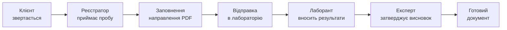

# UniversalLIMS — презентація для керівництва

> **Мета:** показати, що проєкт уже існує, працює і вартий подальшої розробки.  
> **Аудиторія:** головний керівник, заступники, ключові спеціалісти.  
> **Тривалість:** 15–20 хвилин + 5–10 хвилин на питання.  
> **Формат:** можна перенести слайд за слайдом у PowerPoint або Google Slides.

---

## Слайд 1 — Титульний

**UniversalLIMS**  
Лабораторна інформаційна система для ДУ «Житомирський обласний ЦКПХ МОЗ України»

*Цифровізація шляху проби: від прийому до висновку*

Презентує: [ваше ПІБ, посада]  
Дата: [дата]

**Що сказати:** «Це не абстрактна ідея з ТЗ — це вже працюючий прототип, який ми можемо показати на екрані.»

---

## Слайд 2 — З чого все почалося

**Завдання від керівництва (ТЗ):**
- навести лад у роботі з пробами та документами;
- зменшити ручну роботу та помилки;
- забезпечити простежуваність і контроль на рівні, який вимагає акредитація.

**Проблема сьогодні (типовий стан без LIMS):**
- дані розкидані між паперами, Word-файлами та Excel;
- важко швидко знайти справу, клієнта або статус проби;
- немає єдиної картини по філіях (Житомир, Бердичів, Корosten тощо);
- при перевірці або аудиті складно довести, *хто, коли і що змінив*.

**Що сказати:** «Ми не вигадали систему з нуля — ми реалізуємо те, що вже було сформульовано в ТЗ, але робимо це поетапно і з можливістю перевірити результат на кожному кроці.»

---

## Слайд 3 — Що таке LIMS (простими словами)

**LIMS** — Laboratory Information Management System  
*Система управління лабораторною інформацією*

Це **єдине робоче місце**, де:
- реєстратор приймає пробу;
- лаборант вносить результати;
- експерт затверджує висновок;
- керівництво бачить статуси і навантаження.

**Аналогія для керівника:**  
Як медична інформаційна система веде картку пацієнта від реєстрації до виписки — LIMS веде **картку проби** від прийому до офіційного документа.

---

## Слайд 4 — Як виглядає шлях проби в системі



**Ключова ідея:** одна проба — один цифровий ланцюжок. Кожен етап видимий, кожна дія — з іменем відповідального.

**Що сказати:** «Керівнику не потрібно дзвонити в три кабінети, щоб дізнатися, де застрягла справа — статус видно в системі.»

---

## Слайд 5 — Хто працює в системі (ролі)

| Роль | Що робить у системі |
|------|---------------------|
| **Реєстратор** | Створює замовлення, реєструє проби, заповнює направлення, відправляє в лабораторію |
| **Лаборант** | Бачить журнал проб своєї філії, вносить результати у PDF-бланки |
| **Експерт** | Перевіряє готові справи, затверджує або повертає на доопрацювання |
| **Адміністратор** | Шаблони документів, огляд філій, налаштування, контроль |

**Окремо:** один співробітник може мати кілька ролей — система дозволяє перемикатися між ними (наприклад, адміністратор може подивитися робоче місце лаборанта).

---

## Слайд 6 — Що вже зроблено (не план — факт)

| Модуль | Статус |
|--------|--------|
| Фундамент: користувачі, ролі, філії, аудит | ✅ Готово |
| Конструктор шаблонів (PDF + накладення полів) | ✅ Готово |
| Реєстратура: клієнти, замовлення, проби | ✅ Готово |
| Multi-sample: кілька проб у одному замовленні | ✅ Готово |
| PDF Workspace: заповнення бланків на екрані | ✅ Готово |
| Лабораторний журнал + внесення результатів | ✅ Базовий цикл |
| Огляд лабораторій / філій для адміністратора | ✅ Готово |
| Експерт: черга та затвердження (MVP) | ✅ Готово |
| Автоматизовані тести критичних сценаріїв | ✅ Є |

**Що сказати:** «Ми не на етапі «напишемо колись». Система збирається, запускається і проходить перевірки. Наступний крок — не «почати», а **відточити і впровадити**.»

---

## Слайд 7 — Демонстрація (5 хвилин живого показу)

**Рекомендований сценарій демо:**

1. **Портал** — вхід, вибір ролі «Реєстратор».
2. **Нова проба** — створити замовлення з 1–2 дослідженнями, обрати клієнта.
3. **PDF Workspace** — заповнити направлення прямо на екрані (PDF + поля).
4. **Реєстр** — показати, що справа з’явилась, видно статус.
5. **Перемикання на «Лаборант»** — журнал проб, відкрити PDF для результатів.
6. **Перемикання на «Експерт»** — черга на затвердження.

**Підготовка до демо:**
- запустити систему локально або на тестовому сервері;
- мати тестового користувача для кожної ролі;
- підготувати 1 готову «історію» проби на випадок, якщо live-create займе час.

**Що сказати:** «Зараз покажу не презентацію, а саму систему — 5 хвилин, і ви побачите, як це виглядає для співробітника.»

---

## Слайд 8 — Чому це цікаво саме керівництву

### 1. Контроль і прозорість
- Бачно, скільки проб «очікує відправки», скільки «в роботі», скільки «на експертизі».
- Можна порівнювати навантаження між філіями.

### 2. Менше втрат і помилок
- Дані клієнта не переписуються вручну в кожен бланк — система підтягує їх автоматично.
- Номери проб і направлень генеруються системою, без дублікатів.

### 3. Підготовка до акредитації (ISO/IEC 17025)
- Кожна зміна фіксується в журналі аудиту (хто, коли, що змінив).
- Помилкові записи не «стираються» — анулюються з причиною (вимога стандарту).
- Версії шаблонів документів зберігаються — можна довести, який бланк використовувався.

### 4. Масштабованість
- Архітектура розрахована на кілька філій і різні типи досліджень.
- Новий бланк = новий шаблон у конструкторі, без переписування всієї системи.

---

## Слайд 9 — Як це працює «під капотом» (30 секунд, без технічного жаргону)

**Принцип:** офіційний PDF-бланк залишається незмінним (як у друкарні), а дані накладаються поверх нього в потрібних місцях.

```
[Офіційний PDF-бланк]  +  [Дані з системи]  =  [Готовий документ]
```

**Чому це важливо:**
- співробітники бачать **звичний бланк**, а не «чужу форму в браузері»;
- при зміні нормативного документа достатньо оновити шаблон;
- один раз внесені дані клієнта автоматично потрапляють у всі потрібні поля.

**Технічна база (якщо запитають):** .NET 8, веб-інтерфейс, SQL Server — сучасний і підтримуваний стек.

---

## Слайд 10 — Дорожня карта: що далі

| Етап | Зміст | Статус |
|------|-------|--------|
| 0 | Фундамент + конструктор шаблонів | ✅ Завершено |
| 1 | Реєстратура, клієнти, проби | ✅ Завершено |
| 2 | Лабораторний цикл | 🟡 Відточення |
| 3 | Експертиза та затвердження | 🟡 MVP готовий, потрібна стабілізація |
| 4 | Генерація протоколів, друк, архів | ⬜ Наступний етап |
| 5 | Звіти, ISO-модулі, адміністрування | ⬜ Планується |

**Що потрібно для продовження:**
- **Час** на доопрацювання за зворотним зв’язком від реальних користувачів (реєстратор, лаборант).
- **Пілот** на одній філії або одному виді досліджень — перевірити «в бою».
- **Рішення керівництва** про пріоритет проєкту в плані роботи установи.

---

## Слайд 11 — Що дає впровадження (до / після)

| Сьогодні (без LIMS) | З UniversalLIMS |
|---------------------|-----------------|
| Пошук справи — хвилини/години | Секунди через реєстр |
| «Хто останній правив бланк?» — невідомо | Повний аудит з іменем і датою |
| Ризик дублювання номерів проб | Автоматична нумерація |
| Кожен бланк заповнюється окремо | Дані клієнта підтягуються автоматично |
| Немає єдиної картини по філіях | Огляд лабораторій і статусів |
| Складно готуватися до перевірки | Простежуваність за ISO 17025 |

---

## Слайд 12 — Ризики, якщо не продовжувати

- ТЗ залишиться на папері, а ручна робота — зростатиме разом із навантаженням.
- Конкуренти (інші ЦКПХ) вже цифровізуються — відставання у швидкості обслуговування.
- При акредитаційній перевірці складніше продемонструвати контроль версій документів і audit trail.
- Накопичений досвід розробки (архітектура, шаблони, тести) буде складніше відновити «з нуля» пізніше.

**Що сказати:** «Ми вже пройшли найскладніший етап — заклали архітектуру і зробили робочий цикл. Зупинити зараз — означає втратити momentum.»

---

## Слайд 13 — Що прошу від керівництва

1. **Підтримку проєкту** як пріоритету цифровізації установи.
2. **Призначити контактну особу** від кожної ролі (реєстратор, лаборант, експерт) для пілотного тестування.
3. **Дозволити пілот** — 2–4 тижні на одній філії або одному напрямку досліджень.
4. **Зворотний зв’язок** після демо — що критично, що може почекати.
5. **Рішення про наступний етап** — стабілізація + підготовка до робочого середовища.

**Не прошу зараз:** великих бюджетів на закупівлю — система розробляється на відкритих технологіях (.NET, SQL Server).

---

## Слайд 14 — Підсумок

**UniversalLIMS — це:**
- ✅ відповідь на ТЗ від керівництва;
- ✅ працюючий прототип, а не презентація «на майбутнє»;
- ✅ повний цикл проби: реєстрація → лабораторія → експертиза;
- ✅ архітектура під ISO 17025 і кілька філій;
- 🔄 готовий до пілотного впровадження після рішення керівництва.

**Наступний крок:** пілот + зворотний зв’язок → відточення → робоче середовище.

---

## Слайд 15 — Питання?

Контакт: [ваш email / телефон]

---

# Додаток: поради для доповідача

## Як тримати увагу головного керівника

1. **Почніть з проблеми, не з технологій.** «Скільки часу зараз йде на пошук справи?» — риторичне питання, яке всі розуміють.
2. **Покажіть систему на 3–5 хвилин.** Живе демо переконує сильніше за 20 слайдів.
3. **Говоріть мовою вигод:** контроль, швидкість, акредитація, менше помилок.
4. **Будьте чесні про статус:** «MVP експертизи є, генерація протоколів — наступний етап». Це підвищує довіру.
5. **Закінчіть конкретним проханням** (слайд 13), а не «ну от така система».

## Можливі питання і короткі відповіді

| Питання | Відповідь |
|---------|-----------|
| Скільки це коштує? | Розробка ведеться на відкритих технологіях; основні витрати — сервер і час співробітників на тестування. |
| Коли можна використовувати? | Пілот можливий уже зараз; робоче впровадження — після 1–2 циклів зворотного зв’язку. |
| Чи замінить це всі папери одразу? | Ні, впровадження поетапне: спочатку паралельно з папером, потім повний перехід. |
| А якщо зміниться бланк МОЗ? | Оновлюється шаблон у конструкторі; старі версії зберігаються для архіву. |
| Хто буде адмініструвати? | Роль адміністратора в системі вже є; потрібен призначений відповідальний. |
| Чи безпечні дані клієнтів? | Доступ по ролях, аудит дій, дані на сервері установи (не в хмарі сторонніх сервісів). |

## Структура виступу (таймінг)

| Блок | Час |
|------|-----|
| Проблема + контекст ТЗ | 3 хв |
| Що таке LIMS + шлях проби | 3 хв |
| Що вже зроблено | 3 хв |
| **Живе демо** | 5 хв |
| Вигоди для керівництва + ISO | 3 хв |
| Дорожня карта + прохання | 2 хв |
| Питання | 5–10 хв |

---

# Додаток: як перенести в PowerPoint

1. Кожен блок `## Слайд N` = один слайд.
2. Таблиці — скопіювати в PowerPoint або залишити як зображення.
3. Mermaid-діаграмму можна згенерувати на [mermaid.live](https://mermaid.live) і вставити як PNG.
4. Для титульного слайду — логотип ЦКПХ + назва установи.
5. Рекомендована палітра: спокійні кольори (синій/білий), мінімум тексту на слайді.
