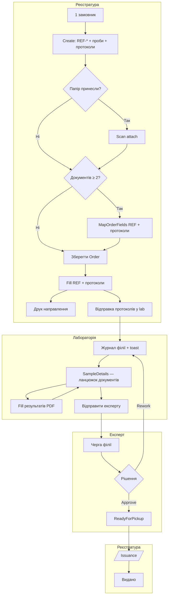

# Master roadmap v2 — пілот ЦКПХ (філії, направлення, сповіщення, мапінг)

> **Оновлено:** 2026-05-30 (план T1/B/R/D — Cursor + Grok)  
> **Призначення:** єдиний документ для подальшої розробки. Збирає рішення з архітектурних обговорень (Cursor + Grok + керівництво), щоб **нічого не загубити** по дорозі.  
> **Аудиторія:** розробник, агент Cursor, технічний куратор проєкту.  
> **Репозиторій:** UniversalLIMS (.NET 8 MVC), UI — українська.

**Перед роботою також читати:**

| Документ | Коли |
|----------|------|
| `handoff-hybrid-tags-and-registry-mapping.md` | теги, мапінг полів |
| `architecture-branches-workstations-notifications.md` | філії, poll, 5–10 ПК |
| `handoff-v1-issuance-and-rework.md` | видача, доопрацювання |
| `handoff-stage-1-registration.md` | SSOT Customer/Sample |
| `spec-hybrid-tags-and-order-field-mapping.md` | короткий spec тегів |

---

## 1. Короткий висновок (TL;DR)

1. **Філії** — одна сутність `Branch` для реєстратури, лабораторій і експертів. **Не** створювати «Робоче місце», `ExpertGroup`, `Workstation`.
2. **Кілька експертів / лабораторій** — через `User.BranchId` + фільтрація черг і сповіщень. Для пар `LAB → EXP` — опційно `Branch.ExpertBranchId` або `Mixed`-філії на пілоті.
3. **Направлення (цифрове)** — реєстратура **формує на бланку**, який адмін завантажив (`REF-*`). Це один із документів замовлення поруч із протоколами — **не окремий модуль**.
4. **Мапінг полів** — вже реалізовано (`OrderFieldLinkGroup`, `MapOrderFields`). Якщо один замовник + направлення + 4 протоколи — **один крок мапінгу** на всі документи: об’єднати «ПІБ», «дата відбору» тощо між REF і протоколами, заповнити один раз. Принесене паперове — скан + перенос у той самий цифровий REF-бланк.
5. **Лабораторія** — UX має повторити ланцюжок реєстратури: **сторінка проби** з таблицею документів і статусів; «Відправити експерту» — **не** в toolbar PDF (тимчасово там, перенести на сторінку проби).
6. **Пріоритет розробки (актуальний):** ~~B1–B2, T1, C2, R1, D1, D6a, D2, D3, G5/G6~~ ✅ → **C1 smoke**.
7. **Терміни UI:** `Order.ReferralNumber` = **«Номер справи»**; слово **«Направлення»** — лише PDF-бланк REF-* (див. `glossary-registration-uk.md`).
8. **REF на пілоті:** основний режим **Per Sample** (1 REF на пробу); Per Order — backlog (§7.0).

---

## 2. Що вже зроблено (не ламати)

### 2.1 Реєстратура

| Функція | Стан | Де |
|---------|------|-----|
| Create замовлення (замовник + проби + шаблони) | ✅ | `Orders/Create` |
| Мапінг спільних полів (2+ шаблони) | ✅ | `Orders/MapOrderFields`, `OrderFieldLinkGroup` |
| Автооб’єднання за **точним збігом тегу** | ✅ | `order-field-mapping.js` |
| Копіювання мапінгу з попереднього замовлення | ✅ | `MapOrderFields` |
| PDF Fill (заповнення бланків) | ✅ | `PdfWorkspaceFillService` |
| Генерація PDF направлення/документів | ✅ | `ReferralPdfGenerator` |
| Фільтр реєстру по `Order.BranchId` | ✅ | `OrderRegistrationService` |
| Видача `/Issuance` | ✅ | `SampleDeliveryService` |
| Сповіщення «готово до видачі» (з фільтром філії) | ✅ | `RegistrationNotificationService` |

### 2.2 Лабораторія

| Функція | Стан | Де |
|---------|------|-----|
| Журнал по `TargetBranchId` | ✅ | `LaboratoryJournalService` |
| Контекст філії (лаборант / адмін session) | ✅ | `LaboratoryBranchContext` |
| «Відправити експерту» (API + сервіс) | ✅ | `LaboratoryDocumentSubmissionService` |
| Сторінка проби з ланцюжком документів (як `Orders/Details`) | ✅ | `/Laboratory/SampleDetails` (G1) |
| «Відправити експерту» у UI | ✅ | лише на SampleDetails; **не** в PDF toolbar (G3) |
| Сповіщення вхідних проб (API + фільтр філії) | ✅ | `LaboratoryJournalService.GetIncomingSinceAsync` |
| Сповіщення в UI (toast/badge) | ✅ (C6) | `lims-route-notify.js`: lookback 24 год замість `now` при першому poll |

### 2.3 Експерт

| Функція | Стан | Де |
|---------|------|-----|
| Черга експерта | ✅ | `ExpertReviewQueueService` |
| Approve / Return to rework | ✅ | `ExpertConclusionService` |
| Poll API сповіщень | ✅ | `ExpertNotificationsApiController` |
| **Фільтр черги по філії експерта** | ✅ (B1) | `ExpertReviewQueueService` + `ExpertBranchId` |
| **Фільтр сповіщень по філії** | ✅ (B2) | `GetIncomingSinceAsync` |

### 2.4 Шаблони

| Функція | Стан | Де |
|---------|------|-----|
| Upload PDF | ✅ | `TemplateVersions/Upload` |
| Upload Word (.doc/.docx) → **авто PDF** | ✅ | `TemplateVersionService`, Syncfusion/LibreOffice |
| Map тегів на PDF | ✅ | `TemplateFields/Map.cshtml` |
| Гібридні теги (f327_, Food_, глобальні) | ✅ Etap 0–1 | `ProtocolTagCatalog`, spec |
| Тип шаблону «Направлення / Протокол» | ✅ (D1) | `TemplatePurpose` на `Template` |

### 2.5 Філії

| Функція | Стан | Де |
|---------|------|-----|
| CRUD філій | ✅ | `BranchesController`, `Branch` |
| `User.BranchId` | ✅ | `ApplicationUser` |
| `Order.BranchId`, `OrderDocument.TargetBranchId` | ✅ | домен |
| `BranchKind` (Registration/Lab/Expert/Mixed) | ✅ | `BranchKind` enum + `Branch.Kind` (A1) |
| `Branch.ExpertBranchId` (LAB→EXP) | ✅ поле + міграція (A4) | UI в `/Branches` — ❌ |
| Фільтр dropdown філій за типом у UI | ❌ | |

---

## 3. Зафіксовані архітектурні рішення (LOCKED)

### 3.1 Філії — одна сутність `Branch`

```
Branch
  Code          — REG-ZHY, LAB-BACT-ZHY, EXP-BER, MIX-BER
  Name          — повна назва підрозділу
  City          — географія (Житомир, Бердичів…)
  BranchKind    — [TODO] Registration | Laboratory | Expert | Mixed
  ExpertBranchId — [TODO, optional] для пар LAB → EXP
```

**Не робити:**

- сутність «Робоче місце №N» (5–10 ПК = одна філія, один реєстр);
- `ExpertDepartment`, `ExpertGroup`, `Workstation`;
- enum з 7+ типами лабораторій (`Bacteriological`, `Virological`…) на v1 — спеціалізація в **Code/Name** (`LAB-BACT-ZHY`).

**Розрізнення ролей:**

| Роль | Прив’язка | Фільтр даних |
|------|-----------|--------------|
| Реєстратор | `User.BranchId` → філія реєстратури | `Order.BranchId` |
| Лаборант | `User.BranchId` → філія лабораторії | `OrderDocument.TargetBranchId` |
| Експерт (Specialist) | `User.BranchId` → філія експерта | **[TODO]** черга + сповіщення |
| Адмін лабораторії | session `ActiveLaboratoryBranchId` | як лаборант, але може перемикати |

**Важливо:** `TargetBranchId` = **лабораторія виконання**, не завжди = філія експерта. Якщо `LAB-BACT-ZHY` і `EXP-ZHY` — різні записи в `Branches`, потрібен mapping (див. §4.2).

### 3.2 Направлення = Template у тому ж замовленні (не окремий модуль)

> Терміни для UI: [glossary-registration-uk.md](glossary-registration-uk.md) — **справа**, **проба**, **бланк PDF**, **REF**.

**Підготовка (адмін, один раз):**

```
Word/PDF бланк → Upload → PDF у системі (авто) → Map тегів на шаблоні → Publish
```

**Щоденна робота (реєстратор):**

```
Create: 1 замовник + REF-* (направлення) + N протоколів (напр. 4)
     → MapOrderFields (якщо документів ≥ 2) — REF + протоколи разом
     → Fill (спільні поля один раз + решта по документах)
     → ReferralPdfGenerator (друк REF окремо / протоколи окремо — [TODO D2])
     → відправка протоколів у lab
```

**Word:** дозволений як **джерело макету**. Система завжди працює з PDF (`TemplateVersionService` конвертує `.doc/.docx` автоматично).

**Коди шаблонів направлення:** `REF-MOZ-GENERAL`, `REF-WATER`, `REF-FOOD` тощо.  
**Коди протоколів:** `f327_*`, `Food_*` тощо — без змін.

**Ключове:** направлення і протоколи — це **`OrderDocument`** одного `Order`. Мапінг спільних полів **не окремий для REF** — використовується існуючий `Orders/MapOrderFields` (див. §7.4).

**Принесене паперове направлення (v1):**

1. Завантажити скан як **додаток до Order** `[TODO: OrderAttachment]`.
2. Реєстратор **переносить дані** у той самий цифровий `REF-*` (Fill у PDF workspace).
3. Далі — звичайний flow: протоколи, Map, lab. **Без OCR** на пілоті.

### 3.3 Три шари даних (не плутати)

| Шар | Де | Приклад |
|-----|-----|---------|
| SSOT (структура) | `Customer`, `Sample`, `Order` | ПІБ, номер проби, номер направлення |
| Динамічні поля | `OrderFieldValue` → `DataFieldId` | `f327_pH`, `Food_SamplingDate` |
| Макет PDF | `TemplateField` + `TemplateFieldSegment` | координати на бланку |

**Мапінг спільних полів** (`OrderFieldLinkGroup`) — на **замовлення**, не глобально. Зв’язує різні теги з одним значенням між **усіма** документами замовлення, включно з REF (напр. `REF_SamplingDate` + `f327_SamplingDate` + `Food_SamplingDate`). Типовий кейс: **1 замовник + 1 направлення + 4 протоколи → один MapOrderFields**.

### 3.4 Заборони (ISO / аудит)

- **Не** auto-match полів за текстом підпису / Title.
- **Не** копіювати `Customer.*` / `Sample.Number` в `OrderFieldValue`.
- **Не** ламати `ReferralPdfOverlayRenderer` без окремого запиту.
- **Не** OCR / імпорт з довільного PDF у 60 протоколів на v1.
- **Не** SignalR на пілоті (poll ~45 с достатньо для 5–10 місць).

---

## 4. Блок A — Філії та багатопідрозділовість

### 4.1 Приклад структури для пілоту (Житомирська обл.)

| Code | Name | BranchKind | City |
|------|------|------------|------|
| `REG-ZHY` | Реєстратура проб Житомир | Registration | Житомир |
| `REG-BER` | Реєстратура Бердичів | Registration | Бердичів |
| `LAB-BACT-ZHY` | Бактеріологічна лабораторія | Laboratory | Житомир |
| `LAB-VIR-ZHY` | Вірусологічна лабораторія | Laboratory | Житомир |
| `EXP-ZHY` | Експертний відділ Житомир | Expert | Житомир |
| `MIX-BER` | Бердичівський підрозділ (lab+expert) | Mixed | Бердичів |
| `MIX-KOR` | Коростенський підрозділ (lab+expert) | Mixed | Корosten |

> Повна структура з [zt.cdc.gov.ua](https://zt.cdc.gov.ua) **не** відтворюється на v1 — лише філії пілоту.

### 4.2 LAB → EXP: три стратегії (обрати одну на пілот)

| Стратегія | Коли | Реалізація |
|-----------|------|------------|
| **Mixed** | Районні підрозділи (Бердичів, Корosten) | Один `BranchId` і для lab, і для expert |
| **ExpertBranchId** | Житомир: кілька lab, один expert pool | `Branch.ExpertBranchId` на LAB-філіях → EXP-ZHY |
| **Sample.ExpertBranchId** | Різні expert pools, ручний вибір | Поле на пробі, задається при «Відправити експерту» |

**Рекомендація для пілоту:** Mixed для районів + `ExpertBranchId` для обласного центру.

### 4.3 Задачі розробки (Блок A)

- [x] **A1.** Enum `BranchKind` + поле на `Branch` + міграція.
- [ ] **A2.** UI `/Branches`: вибір типу при створенні/редагуванні; фільтр списку.
- [ ] **A3.** UI `/Users`: обов’язковий `BranchId` для ролей Registrar, LaboratoryTechnician, Specialist.
- [ ] **A4.** Опційно `Branch.ExpertBranchId` (nullable FK на `Branch`).
- [ ] **A5.** Dropdown філій у Create/Orders — показувати лише релевантні (lab для TargetBranch, reg для Order).
- [ ] **A6.** Seed або admin-інструкція для пілотних філій (таблиця §4.1).
- [ ] **A7.** Тести: реєстратор Бердичева не бачить справи Житомира; лаборант — лише свою `TargetBranchId`.

---

## 5. Блок B — Кілька експертів

### 5.1 Поточна прогалина

`ExpertReviewQueueService.GetQueueAsync` і `GetIncomingSinceAsync` **не фільтрують** по `CurrentUser.BranchId`. При другому експерті на пілоті — критичний баг.

### 5.2 Логіка фільтра (після A4)

Експерт з `User.BranchId = expertBranchId` бачить пробу, якщо:

```
∃ OrderDocument (не Pending, не Annulled):
  document.TargetBranchId == expertBranchId          // Mixed
  OR document.TargetBranch.TargetBranch.ExpertBranchId == expertBranchId  // LAB→EXP mapping
  OR sample.ExpertBranchId == expertBranchId         // якщо додано C-стратегію
```

Для **Mixed**-філії: `TargetBranchId == expertBranchId` достатньо.

### 5.3 Задачі розробки (Блок B)

- [x] **B1.** Фільтр `ExpertReviewQueueService.GetQueueAsync` по філії експерта.
- [x] **B2.** Фільтр `GetIncomingSinceAsync` — те саме.
- [x] **B3.** Сповіщення rework → лаборант: фільтр по `TargetBranchId` (GetReworkSinceAsync + тести).
- [ ] **B4.** UI: у черзі експерта показувати `TargetBranchName` (вже частково є).
- [x] **B5.** Тести: два експерти в різних філіях — кожен бачить лише «свої» проби.

---

## 6. Блок C — Сповіщення (повний ланцюжок)

### 6.1 Цикл (poll ~45 с, `lims-route-notify.js`)

| # | Подія | Хто отримує | Тригер / API |
|---|-------|-------------|--------------|
| 1 | Відправка в лабораторію | Лаборант | `Sample.RoutedAtUtc` → `/api/laboratory/notifications/incoming` |
| 2 | Відправлено експерту | Експерт | `Sample.ResultsEnteredAtUtc` → `/api/expert/notifications/incoming` |
| 3 | Повернено в лабораторію | Лаборант | `ReturnedForReworkAtUtc` → `[TODO: lab rework API]` |
| 4 | Затверджено, готово до видачі | Реєстратор | `Sample.ReadyForPickupAtUtc` → `/api/registration/notifications/...` |
| 5 | Видано клієнту | — | `IssuedAtUtc` (архів, без poll) |

### 6.2 Задачі розробки (Блок C)

- [ ] **C1.** Перевірити крок 1–2–4 end-to-end на пілоті (дзвіночок у navbar).
- [x] **C2.** Rework notification — API + JS для лаборанта при `ReturnedForRework` (toast з причиною → SampleDetails).
- [ ] **C3.** Після B1/B2 — expert notifications лише для своєї філії.
- [ ] **C4.** Документувати для адміна: 5–10 ПК = одна філія, poll на кожному браузері (не баг).
- [ ] **C5.** SignalR — **не v1** (залишити в backlog).
- [x] **C6.** **Баг:** `lims-route-notify.js` — при першому poll не ініціалізувати `lastSeenUtc` як `now`; вікно = останні 24 год.
- [ ] **C7.** При відкритті `/Laboratory` — опційно показати непрочитані проби з `RoutedAtUtc` (якщо poll ще не встиг).

---

## 7. Блок D — Направлення (стандартизовані бланки + спільний мапінг)

### 7.0 Режим прив’язки REF (погоджено Cursor + Grok, 2026-05-30)

| Режим | Sanlab | LIMS | Пілот |
|-------|--------|------|-------|
| **Per Sample** | 1 зразок = 1 паперове направлення | REF-`OrderDocument` на кожну пробу (2 док. на рядок: REF + протокол) | **Основний — реалізувати першим** |
| **Per Order** | 1 направлення на пакет зразків (ТБ тощо) | 1 REF на справу + N протоколів | Backlog; потребує nullable `OrderDocument.SampleId` |

**Не робити на пілоті:** обидва режими одночасно в UI. Default = **Per Sample** (відповідає `OrderDocument.SampleId` required).

**Питання для ЦКПХ (бажано):** «На кожен зразок окремий бланк направлення чи одне на замовлення?» — відповідь впливає лише на пріоритет Per Order.

> **Погоджено (2026-05-30):** цифрове направлення формує **реєстратура** на завантаженому бланку `REF-*`.  
> Направлення й протоколи — **одне замовлення, один клієнт**. Мапінг полів — **той самий** `MapOrderFields`, що вже працює для «1 замовник + 4 протоколи»; REF-документ просто додається до списку документів на мапінгу.

### 7.1 Цифровий flow (основний)

```
Крок 1  Create
        ├── Замовник (1)
        ├── Шаблон направлення REF-*     ← OrderDocument
        └── Проби + протоколи (1–N)      ← OrderDocument(и) на кожну пробу

Крок 2  MapOrderFields  (якщо всього документів ≥ 2)
        ├── Поля REF-MOZ-001
        ├── Поля f327_… (протокол 1)
        ├── Поля Food_… (протокол 2)
        └── … до 4+ протоколів
        → реєстратор об’єднує однакові за змістом (ПІБ, адреса, дата відбору…)
        → автооб’єднання лише за exact tag; copy mapping з попереднього order

Крок 3  CreateWithFieldMapping → Order + FieldLinkGroups + shared OrderFieldValues

Крок 4  PDF Fill
        ├── REF-* (направлення) — заповнити / перевірити
        └── Протоколи — заповнити реєстраційні поля (решту — lab)

Крок 5  Друк / архів
        ├── «Друк направлення» — лише REF (D2 ✅)
        └── Протоколи — окремо або разом з lab flow

Крок 6  Відправка протоколів у лабораторію (REF зазвичай лишається в реєстрації / видається клієнту)
```

**Приклад замовлення:**

| Документ | Template | Призначення |
|----------|----------|-------------|
| Направлення | `REF-MOZ-001` | Intake, друк для клієнта |
| Протокол 1 | `f327` вода | Lab |
| Протокол 2 | `f327` вода (інша проба) | Lab |
| Протокол 3 | `Food_*` | Lab |
| Протокол 4 | `Food_*` | Lab |

→ **5 документів** → обов’язковий `MapOrderFields` → одне введення «Дата відбору» потрапляє на REF і на всі 4 протоколи, якщо реєстратор їх об’єднав.

### 7.2 Що вже працює без нового коду (мапінг)

| Механізм | Стан | Примітка |
|----------|------|----------|
| `MapOrderFields` для 2+ шаблонів | ✅ | REF рахується як ще один шаблон у списку |
| `OrderFieldLinkGroup` на замовлення | ✅ | групи зберігаються на `Order` |
| Auto-merge за exact tag | ✅ | `REF_X` = `REF_X` між версіями |
| Copy mapping з попереднього order | ✅ | за збігом тегів |
| Shared textarea → `OrderFieldValue` | ✅ | `ApplySharedFieldValuesAsync` |

**Що потрібно доробити в UX (не новий мапінг-движок):**

- [x] **D1.** `TemplatePurpose` на `Template` + міграція (Referral / Protocol / Conclusion). UI у `/Templates`; фільтр Create — D6a.
- [x] **D6a (Per Sample, пілот).** У рядку проби на `Orders/Create` — другий select «Бланк направлення REF-*» поруч із «Бланк протоколу»; створює 2 `OrderDocument` на пробу (`ReferralTemplateVersionId` + протокол; REF → `TargetBranchId` реєстратора).
- [ ] **D6b (backlog).** Per Order: один dropdown REF на справу + nullable `SampleId` для referral-документів.
- [ ] **D7.** На `MapOrderFields` — групувати: Per Sample — «REF + протокол проби N»; Per Order — «Направлення | Протокол: f327 | …».
- [ ] **D8a.** QA Per Sample: 1 клієнт + 3 проби + 3 REF + 3 протоколи → Map → Fill.
- [ ] **D8.** QA Per Order: 1 клієнт + 1 REF + 4 протоколи → Map → Fill.

### 7.3 Паперове направлення (другорядний сценарій)

| Крок | Дія |
|------|-----|
| 1 | Клієнт приніс папір/PDF |
| 2 | `[TODO D4]` Upload scan → `OrderAttachment` |
| 3 | Create + REF-* + протоколи — **як у §7.1** |
| 4 | Fill REF-* — реєстратор **переносить** дані з паперу в цифрову форму |
| 5 | Map + lab — без змін |

Скан — для аудиту («що принесли»); робочий документ — **цифровий REF** у системі.

### 7.4 Підготовка бланка направлення (адмін, один раз)

> **Погоджено:** направлення завантажується і обслуговується **як звичайний шаблон (протокол)** — той самий конструктор, калібрування, Fill, права. Окремого редактора для REF **не потрібно**.

#### Три рівні «правки» (однакові для REF і протоколів)

| Рівень | Де | Хто | Що змінюється | Куди зберігається |
|--------|-----|-----|---------------|-------------------|
| **1. Конструктор** | `TemplateFields/Map` | Адмін | Додати/видалити теги, позиція на PDF, шрифт (чернетка версії) | `TemplateField` + `TemplateFieldSegment` |
| **2. Калібрування** | Map **або** PDF Fill → вкладка «Позиція» | Адмін; реєстратор — за FLS | Зсув X/Y, шрифт, line-height (підгонка під лінії бланку) | **Шаблон** (усі майбутні Fill цієї версії) **або** **замовлення** (лише цей документ) |
| **3. Заповнення** | `PdfWorkspace/Fill` з реєстратури | Реєстратор | **Значення** полів (ПІБ, дата, адреса…) | `OrderFieldValue` (лише поточне замовлення) |

**Дві кнопки в Fill (вже є):**

- «Зберегти значення» → текст для **цього** замовлення.
- «Зберегти макет у шаблон» / scope «шаблон / замовлення» → калібрування позицій.

Для направлення реєстратор зазвичай працює на **рівні 3** (значення). Рівень 2 — якщо текст «зливається з лінією»; краще один раз відкалібрувати в шаблоні, щоб усі наступні направлення були рівні.

#### Підготовка REF-бланка (кроки)

1. Офіційний або погоджений бланк МОЗ (Word або PDF).
2. **Templates** → `REF-MOZ-001`, `TemplatePurpose = Referral`.
3. **Upload** `.docx` / `.pdf` (Word → PDF **автоматично**).
4. **Map (конструктор)** — розставити теги: `REF_*` + глобальні `Order.*`, `Sample.*`, `Customer.*`.
5. **Калібрування** — у Map або Fill (scope «шаблон»), поки текст лягає на лінії.
6. **Permissions** — Registrar: Write на поля REF; Lab/Expert: None або Read (направлення їм не заповнювати).
7. **Publish** версії — далі зміни макету лише через **нову версію** (як у протоколах).
8. **Не** прив’язувати REF до `InvestigationType` як протокол — окремий список у Create (D6).

**Word у повсякденній роботі:** лише для підготовки макету адміном. Реєстратор працює в PDF Fill — як з протоколами.

### 7.5 `TemplatePurpose` (рекомендовано)

```csharp
public enum TemplatePurpose
{
    Referral = 1,    // направлення (intake) — заповнює реєстратор
    Protocol = 2,    // лабораторний протокол
    Conclusion = 3   // висновок експерта (майбутнє)
}
```

Поле на `Template` — фільтр у UI (Create, друк), **не** змінює Fill/Map/FieldLinkGroup.

### 7.6 Друк: REF vs протокол

Зараз `ReferralPdfGenerator` збирає **усі** `OrderDocument`. Після REF-шаблонів:

- [ ] **D1.** `TemplatePurpose` на `Template` + міграція.
- [x] **D2.** Кнопки на `Orders/Details`: «Друк направлення» / «Друк протоколів реєстрації».
- [x] **D3.** Параметр `purposeFilter` у `IReferralPdfGenerator.GenerateAsync(orderId, purpose?)`.

REF **не** відправляється в lab як протокол (статус / workflow — лишається в реєстрації); у lab йдуть лише `Protocol` документи.

### 7.7 Додаткові сутності (папір + звіти)

- [ ] **D4.** `OrderAttachment` — scan принесеного PDF/фото на `Orders/Details`.
- [ ] **D5.** `Order.ReferralSource`: `Digital | ExternalPaper` (опційно).

### 7.8 Задачі контенту (паралельно коду)

- [ ] **D-контент-1.** 1–2 бланки REF у Word → upload → map тегів.
- [ ] **D-контент-2.** `docs/data/protocol-tags-ref.json` + seed / optgroup у Map.
- [ ] **D-контент-3.** Інструкція реєстратору: Create → REF + протоколи → Map → Fill (1 стор.).
- [ ] **D-контент-4.** Тестовий кейс QA: 1 клієнт + REF + 4 протоколи + мапінг 3 спільних полів.

---

## 8. Блок G — Лабораторний UX (ланцюжок проби)

> **Контекст (2026-05-30):** у реєстратури `Orders/Details` — зразковий ланцюжок (проба → документи → статуси → маршрут → масова відправка). У лабораторії — плоский журнал і кнопка PDF; «Відправити експерту» сховано в toolbar PDF. Це не масштабується на кілька експертів і ламає UX.

### 8.G.1 Target state (для лаборанта)

```
Журнал проб → клік по пробі → Laboratory/SampleDetails
  ├── шапка: номер, замовник, тип, workflow summary
  ├── таблиця документів: шаблон | статус | «Заповнити PDF» | «Відправити експерту»
  └── (після B + A4) вибір expert branch при відправці — аналог TargetBranch у реєстратора
```

**Не робити:** повертати табличний ResultEntry / «Показники» — заповнення лише в PDF Workspace.

### 8.G.2 Задачі розробки (Блок G)

- [x] **G1.** `GET /Laboratory/SampleDetails/{sampleId}` — картка проби + таблиця документів (стилі як `order-detail-sample` у реєстраторі).
- [x] **G2.** Журнал: посилання «Проба» → SampleDetails; PDF — з таблиці документів.
- [x] **G3.** Перенести «Відправити експерту» з toolbar PDF на SampleDetails (toolbar лишає «Зберегти» / «PDF» / «Фінал» + «← До проби»).
- [ ] **G4.** Після A4/B: dropdown expert branch при відправці (Mixed — auto; LAB→EXP — через `ExpertBranchId`).
- [ ] **G5.** Тести: multi-document sample — часткова відправка документів; повна — `Sample.ResultsEntered`.

---

## 9. Блок E — Мапінг полів (продовження Etap 3+)

### 9.1 Вже зроблено

- `OrderFieldLinkGroup` / `Member` на замовлення.
- `MapOrderFields` + shared values → `ApplySharedFieldValuesAsync`.
- Збережені групи на `Orders/Details`.
- Auto-merge за exact tag; copy mapping з попереднього order.

### 9.2 Далі (не блокує пілот)

- [ ] **E1.** **MappingProfile** — збережений мапінг за комбінацією InvestigationType / шаблонів; пропозиція при Create (реєстратор підтверджує).
- [ ] **E2.** Drag&drop груп у UI мапінгу.
- [ ] **E3.** `FieldTextLibrary` scope по `TemplateVersionId` для REF-шаблонів.
- [ ] **E4.** Розширення каталогів тегів (`docs/data/protocol-tags-*.json`) порціями 30–70.

---

## 10. Блок F — Шаблони та Word→PDF

### 10.1 Факт (не обговорюється)

- Upload: `.pdf`, `.doc`, `.docx`.
- Word **завжди** конвертується в PDF перед збереженням (`TemplateVersionService`).
- Провайдер: Syncfusion (якщо license) або LibreOffice (`WordToPdf:Provider` у config).
- Робота реєстратора/лаборанта — **лише PDF workspace**, не Word runtime.

### 10.2 Legacy Word Content Controls

- Map підтримує legacy режим (Content Controls з Tag у Word).
- Основний шлях v2: **overlay теги на PDF** у `Map.cshtml`.
- «Відкрити в Word» — для адміна при підготовці макету, не для щоденної роботи.

---

## 11. Повний шлях проби (target state після v2)



---

## 12. Порядок реалізації (фази)

### Фаза 1 — Критично для пілоту (1–2 тижні)

| ID | Задача | Блок | Стан |
|----|--------|------|------|
| A1 | BranchKind + міграція | A | ✅ |
| A2–A3 | UI філій + обов’язковий BranchId у Users | A | ❌ |
| **B1–B2** | **Фільтр черги і сповіщень експерта** | B | ✅ |
| **T1** | **UI: «Номер справи»** | UX | ✅ |
| A4 | ExpertBranchId для LAB→EXP (якщо не лише Mixed) | A | ❌ |
| C2, C1 | Rework + end-to-end сповіщення (після B1–B2) | C | 🟡 C6 ✅ |
| G1–G3 | SampleDetails + «Відправити експерту» | G | ✅ |
| **R1** | **`DataFieldScope.Result` → `SampleResultValue` у PDF Save** | Lab | ✅ |
| — | Smoke QA весь ланцюжок | QA | ❌ |

### Фаза 2 — Направлення Per Sample (1–2 тижні, паралельно контент)

| ID | Задача | Блок |
|----|--------|------|
| D1, D2–D3 | TemplatePurpose + розділення друку REF / протоколи | D |
| **D6a** ✅ | REF у рядку проби (Per Sample) | D |
| D-контент-1 | Перший REF-бланк Word → upload → map | D |
| D7, D8a | Групування Map + QA Per Sample | D |
| D4–D5, D6b, D8 | Scan, Per Order, QA пакетного REF — **після пілоту** | backlog |

### Фаза 3 — Зручність (після пілоту)

| ID | Задача | Блок |
|----|--------|------|
| E1 | MappingProfile | E |
| A5 | Dropdown філій за типом | A |
| G4 | Expert branch при відправці (після A4/B) | G |
| C5 | SignalR (якщо потрібно) | backlog |
| — | Автомаршрутизація InvestigationType → Branch | backlog |

---

## 13. Чеклист пілотного QA

### 13.1 Філії

- [ ] Реєстратор REG-BER не бачить orders REG-ZHY.
- [ ] Лаборант LAB-BACT-ZHY бачить лише свої документи в журналі.
- [ ] Експерт EXP-ZHY / MIX-BER бачить лише «свої» проби.
- [ ] Адмін може перемкнути lab context у session.

### 13.2 Ланцюжок

- [ ] Create → Map (2 шаблони) → Fill → Registered.
- [ ] Відправка в lab → toast у лаборанта (навіть якщо журнал відкрили після відправки — після C6).
- [ ] Журнал → SampleDetails → таблиця документів зі статусами (G1).
- [ ] Fill результатів → «Відправити експерту» **на SampleDetails**, не в toolbar PDF (G3).
- [ ] Toast у експерта **своєї** філії (B1–B2).
- [ ] Approve → toast реєстратора → `/Issuance`.
- [ ] «Видано» → архів.
- [ ] Rework → проба назад у lab + toast лаборанта.

### 13.3 Направлення (Per Sample — пілот)

- [ ] REF-шаблон: upload Word → PDF → Map → Publish.
- [ ] Create: **3 проби × (REF + протокол)** → MapOrderFields показує 6 документів.
- [ ] Map: REF проби 1 об’єднано з протоколом проби 1 (не з пробою 2).
- [ ] Fill → значення на PDF; lab Fill → **R1:** результати в `SampleResultValue`.
- [x] «Друк направлення» — лише REF (D2).
- [ ] REF не в lab-журналі; протоколи відправлені в lab.
- [x] UI: колонка «Номер справи», не «Направлення» (T1).

---

## 14. Стартовий prompt для агента Cursor

```text
UniversalLIMS — пілот ЦКПХ (Житомир).

Прочитай docs/roadmap-master-v2-pilot.md (§1 TL;DR, §7 D, §12 фази, §17 активний план).
Терміни: docs/glossary-registration-uk.md.

Поточна фаза: 1.
Наступні задачі (порядок): C1 smoke → D-контент-1.

Ключові рішення (не перепитувати):
- Протокол = PDF-шаблон (OrderDocument), Fill у PDF Workspace; не ResultEntry UI.
- REF-* = той самий механізм; на пілоті Per Sample (1 REF на пробу).
- Order.ReferralNumber у UI = «Номер справи»; «Направлення» = лише REF-бланк.
- SampleResultValue для Result scope — запис у PDF Save (R1 ✅); annul+insert при оновленні.
- G1–G3 (SampleDetails + експерту) — зроблено; не дублювати.

Правила:
- Не Workstation, ExpertGroup, окремий Referral entity.
- Word → PDF авто; не Word runtime.
- Не auto-match полів за Title.
- Не ламати ReferralPdfOverlayRenderer без запиту.
- dotnet test перед завершенням.
- Коміт лише якщо явно просять.
```

---

## 15. Backlog (явно не v1)

- SignalR замість poll.
- OCR зовнішнього направлення.
- Ієрархія філій (обласний центр → район).
- Enum типів лабораторій (Bacteriological, Virological…) замість Code/Name.
- Призначення проби конкретному лаборанту (зараз — спільна черга філії).
- Повна структура територіальних підрозділів з zt.cdc.gov.ua.
- Автомаршрутизація за типом дослідження → TargetBranchId.

---

## 16. Історія рішень (контекст)

| Дата | Рішення |
|------|---------|
| 2026-05-26 | Гібридні теги + мапінг у реєстратурі (без auto-match) |
| 2026-05-30 | Філії без Workstation; poll сповіщення; видача + rework |
| 2026-05-30 | Branch як ядро для lab/reg/expert; BranchKind замість 7+ lab types |
| 2026-05-30 | Направлення = Template REF-*; Word→PDF авто; папір = scan + ручний ввід |
| 2026-05-30 | REF + N протоколів — один MapOrderFields (існуючий мапінг, без нового движка) |
| 2026-05-30 | Пріоритет: філії + expert filter → сповіщення + lab UX → REF-шаблони |
| 2026-05-30 | Lab UX: SampleDetails як Orders/Details; «Експерту» не в PDF toolbar; баг lastSeenUtc у poll |
| 2026-05-30 | T1: UI «Номер справи» замість «Направлення» для Order.ReferralNumber |
| 2026-05-30 | Реєстратура UX: «справа / проба / бланк PDF»; glossary; Details групує документи по пробах |

---

## 17. Активний план (handoff для нового агента)

**Контекст:** архітектура погоджена (Cursor + Grok + керівництво). Не перебудовувати. Закрити прогалини по пріоритету.

### Що вже працює (не ламати)

- Create / MapOrderFields / PDF Fill / Issuance / rework
- `Orders/Details` — проби з документами по `SampleId`
- `Laboratory/SampleDetails` — Fill + «Відправити готові» (G1–G3 ✅)
- Poll сповіщення (C6 ✅)
- `BranchKind` (A1 ✅)
- Expert queue + toast фільтр по філії (B1–B2 ✅)
- UI «Номер справи» для `Order.ReferralNumber` (T1 ✅)

### Наступні задачі (строго по порядку)

| # | ID | Що зробити | Файли / зона |
|---|-----|------------|--------------|
| 1 | B1–B2 | ✅ Фільтр expert queue + notifications по BranchId | `ExpertReviewQueueService.cs` |
| 2 | T1 | ✅ «Номер справи» в Index/Lab/Issuance/Expert | Views |
| 3 | C2 | ✅ Rework toast → SampleDetails + причина | lims-route-notify.js |
| 4 | R1 | ✅ `SampleResultValue` при PDF Save (Result scope + annul on update) | Fill service |
| 5 | D1 | ✅ `TemplatePurpose` enum + migration + UI `/Templates` | Template |
| 6 | D6a | ✅ REF select у рядку проби Create → 2 OrderDocument на Sample | Create VM, `OrderRegistrationService`, `order-create.js` |
| 7 | D2–D3 | ✅ Друк REF / протоколів окремо (`purposeFilter`, Orders/Details) | `ReferralPdfGenerator`, `OrdersController` |
| 8 | G5/G6 | ✅ Адмін hub lab+expert | `/Laboratories`, `/Users` |
| 9 | C1 | End-to-end smoke QA (2 експерти + rework) | manual |
| 10 | D-контент-1 | Перший REF-бланк у Templates | admin + docs |

### Технічні нотатки

- **`OrderDocument.SampleId`** — required; Per Sample REF не потребує зміни схеми.
- **`Branch.ExpertBranchId`** — поле є; для LAB→EXP задати в БД або через UI (A4 UI — backlog).
- **`ReferralNumber` у коді/БД** — не перейменовувати; лише UI labels (T1).
- **Lab результати** з `DataFieldScope.Result` зберігаються в `SampleResultValue` (R1 ✅); OrderFieldValue — реєстрація/проба.

### Заборонено на v1

Окремий Referral entity, Workstation, OCR, auto-match полів за Title, ResultEntry UI, SignalR.

---

*Документ збирає обговорення архітектури філій, експертів, направлень і мапінгу. Оновлювати при закритті фаз або зміні рішень.*
