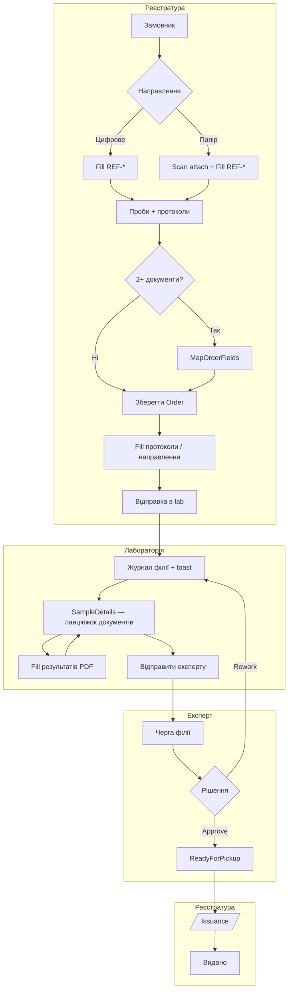

# Master roadmap v2 — пілот ЦКПХ (філії, направлення, сповіщення, мапінг)

> **Оновлено:** 2026-05-30  
> **Призначення:** єдиний документ для подальшої розробки. Збирає рішення з архітектурних обговорень (Cursor + Grok + керівництво), щоб **нічого не загубити** по дорозі.  
> **Аудиторія:** розробник, агент Cursor, технічний куратор проєкту.  
> **Репозиторій:** UniversalLIMS (.NET 8 MVC), UI — українська.

**Перед роботою також читати:**

| Документ | Коли |
|----------|------|
| `handoff-hybrid-tags-and-registry-mapping.md` | теги, мапінг полів |
| `architecture-branches-workstations-notifications.md` | філії, poll, 5–10 ПК |
| `handoff-v1-issuance-and-rework.md` | видача, доопрацювання |
| `handoff-stage-1-registration.md` | SSOT Customer/Sample |
| `spec-hybrid-tags-and-order-field-mapping.md` | короткий spec тегів |

---

## 1. Короткий висновок (TL;DR)

1. **Філії** — одна сутність `Branch` для реєстратури, лабораторій і експертів. **Не** створювати «Робоче місце», `ExpertGroup`, `Workstation`.
2. **Кілька експертів / лабораторій** — через `User.BranchId` + фільтрація черг і сповіщень. Для пар `LAB → EXP` — опційно `Branch.ExpertBranchId` або `Mixed`-філії на пілоті.
3. **Направлення** — звичайний `Template` (код `REF-*`). Word/PDF завантажується → **автоконвертація в PDF** → Map тегів → Fill у реєстратурі. Принесене паперове — скан + ручний перенос у цифрову форму.
4. **Мапінг полів** — вже реалізовано (`OrderFieldLinkGroup`). Об’єднання полів між **направленням і протоколами** — той самий механізм.
5. **Лабораторія** — UX має повторити ланцюжок реєстратури: **сторінка проби** з таблицею документів і статусів; «Відправити експерту» — **не** в toolbar PDF (тимчасово там, перенести на сторінку проби).
6. **Пріоритет розробки:** філії + фільтр експерта → фікс сповіщень + lab UX → направлення REF-* → профілі мапінгу (пізніше).

---

## 2. Що вже зроблено (не ламати)

### 2.1 Реєстратура

| Функція | Стан | Де |
|---------|------|-----|
| Create замовлення (замовник + проби + шаблони) | ✅ | `Orders/Create` |
| Мапінг спільних полів (2+ шаблони) | ✅ | `Orders/MapOrderFields`, `OrderFieldLinkGroup` |
| Автооб’єднання за **точним збігом тегу** | ✅ | `order-field-mapping.js` |
| Копіювання мапінгу з попереднього замовлення | ✅ | `MapOrderFields` |
| PDF Fill (заповнення бланків) | ✅ | `PdfWorkspaceFillService` |
| Генерація PDF направлення/документів | ✅ | `ReferralPdfGenerator` |
| Фільтр реєстру по `Order.BranchId` | ✅ | `OrderRegistrationService` |
| Видача `/Issuance` | ✅ | `SampleDeliveryService` |
| Сповіщення «готово до видачі» (з фільтром філії) | ✅ | `RegistrationNotificationService` |

### 2.2 Лабораторія

| Функція | Стан | Де |
|---------|------|-----|
| Журнал по `TargetBranchId` | ✅ | `LaboratoryJournalService` |
| Контекст філії (лаборант / адмін session) | ✅ | `LaboratoryBranchContext` |
| «Відправити експерту» (API + сервіс) | ✅ | `LaboratoryDocumentSubmissionService` |
| Сторінка проби з ланцюжком документів (як `Orders/Details`) | ✅ | `/Laboratory/SampleDetails` (G1) |
| «Відправити експерту» у UI | ✅ | лише на SampleDetails; **не** в PDF toolbar (G3) |
| Сповіщення вхідних проб (API + фільтр філії) | ✅ | `LaboratoryJournalService.GetIncomingSinceAsync` |
| Сповіщення в UI (toast/badge) | ✅ (C6) | `lims-route-notify.js`: lookback 24 год замість `now` при першому poll |

### 2.3 Експерт

| Функція | Стан | Де |
|---------|------|-----|
| Черга експерта | ✅ | `ExpertReviewQueueService` |
| Approve / Return to rework | ✅ | `ExpertConclusionService` |
| Poll API сповіщень | ✅ | `ExpertNotificationsApiController` |
| **Фільтр черги по філії експерта** | ❌ **Прогалина** | усі експерти бачать усі проби |
| **Фільтр сповіщень по філії** | ❌ **Прогалина** | те саме |

### 2.4 Шаблони

| Функція | Стан | Де |
|---------|------|-----|
| Upload PDF | ✅ | `TemplateVersions/Upload` |
| Upload Word (.doc/.docx) → **авто PDF** | ✅ | `TemplateVersionService`, Syncfusion/LibreOffice |
| Map тегів на PDF | ✅ | `TemplateFields/Map.cshtml` |
| Гібридні теги (f327_, Food_, глобальні) | ✅ Etap 0–1 | `ProtocolTagCatalog`, spec |
| Тип шаблону «Направлення / Протокол» | ❌ | немає `TemplatePurpose` |

### 2.5 Філії

| Функція | Стан | Де |
|---------|------|-----|
| CRUD філій | ✅ | `BranchesController`, `Branch` |
| `User.BranchId` | ✅ | `ApplicationUser` |
| `Order.BranchId`, `OrderDocument.TargetBranchId` | ✅ | домен |
| `BranchKind` (Registration/Lab/Expert/Mixed) | ✅ | `BranchKind` enum + `Branch.Kind` (A1) |
| `Branch.ExpertBranchId` (LAB→EXP) | ❌ | немає |
| Фільтр dropdown філій за типом у UI | ❌ | |

---

## 3. Зафіксовані архітектурні рішення (LOCKED)

### 3.1 Філії — одна сутність `Branch`

```
Branch
  Code          — REG-ZHY, LAB-BACT-ZHY, EXP-BER, MIX-BER
  Name          — повна назва підрозділу
  City          — географія (Житомир, Бердичів…)
  BranchKind    — [TODO] Registration | Laboratory | Expert | Mixed
  ExpertBranchId — [TODO, optional] для пар LAB → EXP
```

**Не робити:**

- сутність «Робоче місце №N» (5–10 ПК = одна філія, один реєстр);
- `ExpertDepartment`, `ExpertGroup`, `Workstation`;
- enum з 7+ типами лабораторій (`Bacteriological`, `Virological`…) на v1 — спеціалізація в **Code/Name** (`LAB-BACT-ZHY`).

**Розрізнення ролей:**

| Роль | Прив’язка | Фільтр даних |
|------|-----------|--------------|
| Реєстратор | `User.BranchId` → філія реєстратури | `Order.BranchId` |
| Лаборант | `User.BranchId` → філія лабораторії | `OrderDocument.TargetBranchId` |
| Експерт (Specialist) | `User.BranchId` → філія експерта | **[TODO]** черга + сповіщення |
| Адмін лабораторії | session `ActiveLaboratoryBranchId` | як лаборант, але може перемикати |

**Важливо:** `TargetBranchId` = **лабораторія виконання**, не завжди = філія експерта. Якщо `LAB-BACT-ZHY` і `EXP-ZHY` — різні записи в `Branches`, потрібен mapping (див. §4.2).

### 3.2 Направлення = Template (не окремий модуль)

```
Word/PDF бланк → Upload → PDF у системі (авто) → Map тегів → Publish
                                                          ↓
                                            Реєстратура: PDF Fill → OrderFieldValue
                                                          ↓
                                            ReferralPdfGenerator (друк/архів)
```

**Word:** дозволений як **джерело макету**. Система завжди працює з PDF (`TemplateVersionService` конвертує `.doc/.docx` автоматично).

**Коди шаблонів направлення:** `REF-MOZ-GENERAL`, `REF-WATER`, `REF-FOOD` тощо.

**Принесене паперове направлення (v1):**

1. Завантажити скан як **додаток до Order** `[TODO: OrderAttachment]`.
2. Реєстратор **переносить дані** у цифровий шаблон `REF-*` вручну.
3. **Без OCR** на пілоті.

### 3.3 Три шари даних (не плутати)

| Шар | Де | Приклад |
|-----|-----|---------|
| SSOT (структура) | `Customer`, `Sample`, `Order` | ПІБ, номер проби, номер направлення |
| Динамічні поля | `OrderFieldValue` → `DataFieldId` | `f327_pH`, `Food_SamplingDate` |
| Макет PDF | `TemplateField` + `TemplateFieldSegment` | координати на бланку |

**Мапінг спільних полів** (`OrderFieldLinkGroup`) — на **замовлення**, не глобально. Зв’язує різні теги з одним значенням (напр. `f327_SamplingDate` + `Food_SamplingDate` + поле на направленні).

### 3.4 Заборони (ISO / аудит)

- **Не** auto-match полів за текстом підпису / Title.
- **Не** копіювати `Customer.*` / `Sample.Number` в `OrderFieldValue`.
- **Не** ламати `ReferralPdfOverlayRenderer` без окремого запиту.
- **Не** OCR / імпорт з довільного PDF у 60 протоколів на v1.
- **Не** SignalR на пілоті (poll ~45 с достатньо для 5–10 місць).

---

## 4. Блок A — Філії та багатопідрозділовість

### 4.1 Приклад структури для пілоту (Житомирська обл.)

| Code | Name | BranchKind | City |
|------|------|------------|------|
| `REG-ZHY` | Реєстратура проб Житомир | Registration | Житомир |
| `REG-BER` | Реєстратура Бердичів | Registration | Бердичів |
| `LAB-BACT-ZHY` | Бактеріологічна лабораторія | Laboratory | Житомир |
| `LAB-VIR-ZHY` | Вірусологічна лабораторія | Laboratory | Житомир |
| `EXP-ZHY` | Експертний відділ Житомир | Expert | Житомир |
| `MIX-BER` | Бердичівський підрозділ (lab+expert) | Mixed | Бердичів |
| `MIX-KOR` | Коростенський підрозділ (lab+expert) | Mixed | Корosten |

> Повна структура з [zt.cdc.gov.ua](https://zt.cdc.gov.ua) **не** відтворюється на v1 — лише філії пілоту.

### 4.2 LAB → EXP: три стратегії (обрати одну на пілот)

| Стратегія | Коли | Реалізація |
|-----------|------|------------|
| **Mixed** | Районні підрозділи (Бердичів, Корosten) | Один `BranchId` і для lab, і для expert |
| **ExpertBranchId** | Житомир: кілька lab, один expert pool | `Branch.ExpertBranchId` на LAB-філіях → EXP-ZHY |
| **Sample.ExpertBranchId** | Різні expert pools, ручний вибір | Поле на пробі, задається при «Відправити експерту» |

**Рекомендація для пілоту:** Mixed для районів + `ExpertBranchId` для обласного центру.

### 4.3 Задачі розробки (Блок A)

- [x] **A1.** Enum `BranchKind` + поле на `Branch` + міграція.
- [ ] **A2.** UI `/Branches`: вибір типу при створенні/редагуванні; фільтр списку.
- [ ] **A3.** UI `/Users`: обов’язковий `BranchId` для ролей Registrar, LaboratoryTechnician, Specialist.
- [ ] **A4.** Опційно `Branch.ExpertBranchId` (nullable FK на `Branch`).
- [ ] **A5.** Dropdown філій у Create/Orders — показувати лише релевантні (lab для TargetBranch, reg для Order).
- [ ] **A6.** Seed або admin-інструкція для пілотних філій (таблиця §4.1).
- [ ] **A7.** Тести: реєстратор Бердичева не бачить справи Житомира; лаборант — лише свою `TargetBranchId`.

---

## 5. Блок B — Кілька експертів

### 5.1 Поточна прогалина

`ExpertReviewQueueService.GetQueueAsync` і `GetIncomingSinceAsync` **не фільтрують** по `CurrentUser.BranchId`. При другому експерті на пілоті — критичний баг.

### 5.2 Логіка фільтра (після A4)

Експерт з `User.BranchId = expertBranchId` бачить пробу, якщо:

```
∃ OrderDocument (не Pending, не Annulled):
  document.TargetBranchId == expertBranchId          // Mixed
  OR document.TargetBranch.TargetBranch.ExpertBranchId == expertBranchId  // LAB→EXP mapping
  OR sample.ExpertBranchId == expertBranchId         // якщо додано C-стратегію
```

Для **Mixed**-філії: `TargetBranchId == expertBranchId` достатньо.

### 5.3 Задачі розробки (Блок B)

- [ ] **B1.** Фільтр `ExpertReviewQueueService.GetQueueAsync` по філії експерта.
- [ ] **B2.** Фільтр `GetIncomingSinceAsync` — те саме.
- [ ] **B3.** Сповіщення rework → лаборант: фільтр по `TargetBranchId` (перевірити наявну реалізацію).
- [ ] **B4.** UI: у черзі експерта показувати `TargetBranchName` (вже частково є).
- [ ] **B5.** Тести: два експерти в різних філіях — кожен бачить лише «свої» проби.

---

## 6. Блок C — Сповіщення (повний ланцюжок)

### 6.1 Цикл (poll ~45 с, `lims-route-notify.js`)

| # | Подія | Хто отримує | Тригер / API |
|---|-------|-------------|--------------|
| 1 | Відправка в лабораторію | Лаборант | `Sample.RoutedAtUtc` → `/api/laboratory/notifications/incoming` |
| 2 | Відправлено експерту | Експерт | `Sample.ResultsEnteredAtUtc` → `/api/expert/notifications/incoming` |
| 3 | Повернено в лабораторію | Лаборант | `ReturnedForReworkAtUtc` → `[TODO: lab rework API]` |
| 4 | Затверджено, готово до видачі | Реєстратор | `Sample.ReadyForPickupAtUtc` → `/api/registration/notifications/...` |
| 5 | Видано клієнту | — | `IssuedAtUtc` (архів, без poll) |

### 6.2 Задачі розробки (Блок C)

- [ ] **C1.** Перевірити крок 1–2–4 end-to-end на пілоті (дзвіночок у navbar).
- [ ] **C2.** Rework notification — API + JS для лаборанта при `ReturnedForRework` (частково є `GetReworkSinceAsync` + JS; перевірити end-to-end).
- [ ] **C3.** Після B1/B2 — expert notifications лише для своєї філії.
- [ ] **C4.** Документувати для адміна: 5–10 ПК = одна філія, poll на кожному браузері (не баг).
- [ ] **C5.** SignalR — **не v1** (залишити в backlog).
- [x] **C6.** **Баг:** `lims-route-notify.js` — при першому poll не ініціалізувати `lastSeenUtc` як `now`; вікно = останні 24 год.
- [ ] **C7.** При відкритті `/Laboratory` — опційно показати непрочитані проби з `RoutedAtUtc` (якщо poll ще не встиг).

---

## 7. Блок D — Направлення (стандартизовані бланки)

### 7.1 Два сценарії intake

| Сценарій | Дії реєстратора |
|----------|-----------------|
| **Цифрове** | Create → (опційно REF-шаблон) → проби + протоколи → Map полів → Fill → відправка в lab |
| **Паперове** | Upload scan `[TODO]` → Create → Fill REF-* (перенести з паперу) → далі як цифрове |

### 7.2 Підготовка бланка направлення (адмін, один раз)

1. Отримати офіційний бланк МОЗ (Word або PDF).
2. **Templates** → створити шаблон `REF-MOZ-001` «Направлення (загальне)».
3. **Upload** версії: `.docx` або `.pdf` (Word → PDF **автоматично**).
4. **Map** — розставити теги (глобальні `Order.*`, `Sample.*`, `Customer.*` де можливо + локальні `REF_*`).
5. **Publish** версії.
6. **Permissions** — Registrar: Read+Write на поля направлення.
7. (Опційно) Прив’язати до `InvestigationType` або показувати в Create окремим списком «Шаблони направлень».

### 7.3 `TemplatePurpose` (рекомендовано)

```csharp
public enum TemplatePurpose
{
    Referral = 1,    // направлення (intake)
    Protocol = 2,    // лабораторний протокол
    Conclusion = 3   // висновок експерта (майбутнє)
}
```

Поле на `Template` — для фільтра в UI, **не** змінює ядро Fill/Map.

### 7.4 `ReferralPdfGenerator` — уточнення

Зараз генератор збирає **усі** `OrderDocument` замовлення. Після введення REF-шаблонів:

- [ ] **D1.** `TemplatePurpose` на `Template`.
- [ ] **D2.** Кнопки: «Друк направлення» (лише Referral docs) / «Друк протоколів» (лише Protocol).
- [ ] **D3.** Або параметр `purpose` у `IReferralPdfGenerator.GenerateAsync`.
- [ ] **D4.** `OrderAttachment` — таблиця + upload scan на `Orders/Details`.
- [ ] **D5.** `Order.ReferralSource` enum: `Digital | ExternalPaper` (опційно, для звітів).
- [ ] **D6.** Create flow: явний крок «Обрати шаблон направлення» (якщо не через InvestigationType).
- [ ] **D7.** MapOrderFields: REF + протоколи в одному мапінгу (вже підтримується технічно — перевірити UX).

### 7.5 Задачі контенту (паралельно коду)

- [ ] **D-контент-1.** 1–2 бланки направлення в Word → upload → map.
- [ ] **D-контент-2.** Теги REF у `ProtocolTagCatalog` або окремий `docs/data/protocol-tags-ref.json`.
- [ ] **D-контент-3.** Інструкція реєстратору (1 сторінка PDF).

---

## 8. Блок G — Лабораторний UX (ланцюжок проби)

> **Контекст (2026-05-30):** у реєстратури `Orders/Details` — зразковий ланцюжок (проба → документи → статуси → маршрут → масова відправка). У лабораторії — плоский журнал і кнопка PDF; «Відправити експерту» сховано в toolbar PDF. Це не масштабується на кілька експертів і ламає UX.

### 8.G.1 Target state (для лаборанта)

```
Журнал проб → клік по пробі → Laboratory/SampleDetails
  ├── шапка: номер, замовник, тип, workflow summary
  ├── таблиця документів: шаблон | статус | «Заповнити PDF» | «Відправити експерту»
  └── (після B + A4) вибір expert branch при відправці — аналог TargetBranch у реєстратора
```

**Не робити:** повертати табличний ResultEntry / «Показники» — заповнення лише в PDF Workspace.

### 8.G.2 Задачі розробки (Блок G)

- [x] **G1.** `GET /Laboratory/SampleDetails/{sampleId}` — картка проби + таблиця документів (стилі як `order-detail-sample` у реєстраторі).
- [x] **G2.** Журнал: посилання «Проба» → SampleDetails; PDF — з таблиці документів.
- [x] **G3.** Перенести «Відправити експерту» з toolbar PDF на SampleDetails (toolbar лишає «Зберегти» / «PDF» / «Фінал» + «← До проби»).
- [ ] **G4.** Після A4/B: dropdown expert branch при відправці (Mixed — auto; LAB→EXP — через `ExpertBranchId`).
- [ ] **G5.** Тести: multi-document sample — часткова відправка документів; повна — `Sample.ResultsEntered`.

---

## 9. Блок E — Мапінг полів (продовження Etap 3+)

### 9.1 Вже зроблено

- `OrderFieldLinkGroup` / `Member` на замовлення.
- `MapOrderFields` + shared values → `ApplySharedFieldValuesAsync`.
- Збережені групи на `Orders/Details`.
- Auto-merge за exact tag; copy mapping з попереднього order.

### 9.2 Далі (не блокує пілот)

- [ ] **E1.** **MappingProfile** — збережений мапінг за комбінацією InvestigationType / шаблонів; пропозиція при Create (реєстратор підтверджує).
- [ ] **E2.** Drag&drop груп у UI мапінгу.
- [ ] **E3.** `FieldTextLibrary` scope по `TemplateVersionId` для REF-шаблонів.
- [ ] **E4.** Розширення каталогів тегів (`docs/data/protocol-tags-*.json`) порціями 30–70.

---

## 10. Блок F — Шаблони та Word→PDF

### 10.1 Факт (не обговорюється)

- Upload: `.pdf`, `.doc`, `.docx`.
- Word **завжди** конвертується в PDF перед збереженням (`TemplateVersionService`).
- Провайдер: Syncfusion (якщо license) або LibreOffice (`WordToPdf:Provider` у config).
- Робота реєстратора/лаборанта — **лише PDF workspace**, не Word runtime.

### 10.2 Legacy Word Content Controls

- Map підтримує legacy режим (Content Controls з Tag у Word).
- Основний шлях v2: **overlay теги на PDF** у `Map.cshtml`.
- «Відкрити в Word» — для адміна при підготовці макету, не для щоденної роботи.

---

## 11. Повний шлях проби (target state після v2)



---

## 12. Порядок реалізації (фази)

### Фаза 1 — Критично для пілоту (1–2 тижні)

| ID | Задача | Блок |
|----|--------|------|
| A1–A3 | BranchKind + UI філій + обов’язковий BranchId у Users | A |
| B1–B2 | Фільтр черги і сповіщень експерта | B |
| A4 | ExpertBranchId для LAB→EXP (якщо не лише Mixed) | A |
| C2, C6 | Rework notification + фікс `lastSeenUtc` у poll | C |
| G1–G3 | SampleDetails + перенос «Відправити експерту» з PDF toolbar | G |
| — | Smoke QA весь ланцюжок | QA |

### Фаза 2 — Направлення (1–2 тижні, паралельно контент)

| ID | Задача | Блок |
|----|--------|------|
| D1–D3 | TemplatePurpose + розділення друку | D |
| D4–D5 | OrderAttachment + ReferralSource | D |
| D-контент | Перший REF-бланк у системі | D |
| D6–D7 | UX Create з направленням | D |

### Фаза 3 — Зручність (після пілоту)

| ID | Задача | Блок |
|----|--------|------|
| E1 | MappingProfile | E |
| A5 | Dropdown філій за типом | A |
| G4 | Expert branch при відправці (після A4/B) | G |
| C5 | SignalR (якщо потрібно) | backlog |
| — | Автомаршрутизація InvestigationType → Branch | backlog |

---

## 13. Чеклист пілотного QA

### 13.1 Філії

- [ ] Реєстратор REG-BER не бачить orders REG-ZHY.
- [ ] Лаборант LAB-BACT-ZHY бачить лише свої документи в журналі.
- [ ] Експерт EXP-ZHY / MIX-BER бачить лише «свої» проби.
- [ ] Адмін може перемкнути lab context у session.

### 13.2 Ланцюжок

- [ ] Create → Map (2 шаблони) → Fill → Registered.
- [ ] Відправка в lab → toast у лаборанта (навіть якщо журнал відкрили після відправки — після C6).
- [ ] Журнал → SampleDetails → таблиця документів зі статусами (G1).
- [ ] Fill результатів → «Відправити експерту» **на SampleDetails**, не в toolbar PDF (G3).
- [ ] Toast у експерта **своєї** філії (B1–B2).
- [ ] Approve → toast реєстратора → `/Issuance`.
- [ ] «Видано» → архів.
- [ ] Rework → проба назад у lab + toast лаборанта.

### 13.3 Направлення

- [ ] REF-шаблон: upload Word → PDF у системі → Map → Fill → друк.
- [ ] Паперове: scan attach + fill digital (ручний перенос).
- [ ] Спільні поля REF + протокол через MapOrderFields.

---

## 14. Стартовий prompt для агента Cursor

```text
UniversalLIMS — пілот ЦКПХ.

Прочитай docs/roadmap-master-v2-pilot.md (master roadmap).

Поточна фаза: [1 / 2 / 3].
Задачі: [наприклад B1–B2: фільтр ExpertReviewQueueService по BranchId].

Правила:
- Не створювати Workstation, ExpertGroup, окремий Referral entity.
- Word upload уже → PDF автоматично; не будувати Word runtime.
- Не auto-match полів за Title.
- Не ламати ReferralPdfOverlayRenderer без запиту.
- dotnet test перед завершенням.
- Коміт лише якщо явно просять.
```

---

## 15. Backlog (явно не v1)

- SignalR замість poll.
- OCR зовнішнього направлення.
- Ієрархія філій (обласний центр → район).
- Enum типів лабораторій (Bacteriological, Virological…) замість Code/Name.
- Призначення проби конкретному лаборанту (зараз — спільна черга філії).
- Повна структура територіальних підрозділів з zt.cdc.gov.ua.
- Автомаршрутизація за типом дослідження → TargetBranchId.

---

## 16. Історія рішень (контекст)

| Дата | Рішення |
|------|---------|
| 2026-05-26 | Гібридні теги + мапінг у реєстратурі (без auto-match) |
| 2026-05-30 | Філії без Workstation; poll сповіщення; видача + rework |
| 2026-05-30 | Branch як ядро для lab/reg/expert; BranchKind замість 7+ lab types |
| 2026-05-30 | Направлення = Template REF-*; Word→PDF авто; папір = scan + ручний ввід |
| 2026-05-30 | Пріоритет: філії + expert filter → сповіщення + lab UX → REF-шаблони |
| 2026-05-30 | Lab UX: SampleDetails як Orders/Details; «Експерту» не в PDF toolbar; баг lastSeenUtc у poll |

---

*Документ збирає обговорення архітектури філій, експертів, направлень і мапінгу. Оновлювати при закритті фаз або зміні рішень.*
